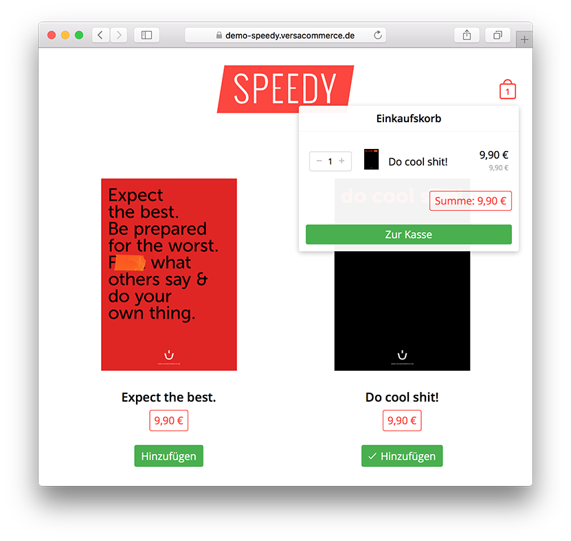

# Speedy - ein super-schnelles Theme für VersaCommerce

Speedy ist ein Theme für VersaCommerce, das mit nur einer HTTP Anfrage
funktioniert. Alle Warenkorbdaten werden lokal beim Benutzer im
`localStorage` des Browsers gespeichert. Zusammen mit einem CDN wie
Amazon Cloudfront lässt sich damit ein Shop aufbauen, der auch sehr
großem Besucheransturm innerhalb kürzester Zeit gewachsen ist.

Eine Demo des Themes ist [hier](https://demo-speedy.versacommerce.de)
verfügbar.

*Ein Theme von und für [VersaCommerce](http://www.versacommerce.de/),
der besten Shop-Software aus der Cloud*
